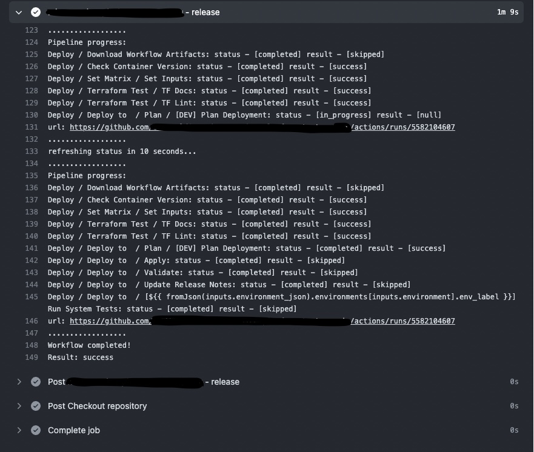

# Repository Dispatch Trigger

This GitHub Action triggers a workflow using repository_dispatch and monitors the progress. 

## Features

The Repository Dispatch Trigger action offers the following features:

- Monitors the triggered workflow lifecycle, providing real-time updates on the status and progress of the workflow. This allows you to easily track the execution and completion of the triggered workflow.

- Reflects the results of the triggered pipeline. Once the triggered workflow completes, you can access the results and outcomes of the workflow execution. This allows you to capture the outputs and use them for subsequent steps or processes in your workflow.

These features make it convenient to monitor and leverage the results of the triggered workflow, enabling seamless integration and automation within your CI/CD pipelines or other automation processes.

## Inputs

| Name                | Description                         | Required | Default |
|---------------------|-------------------------------------|----------|---------|
| `github_token`      | GitHub token for authentication.    | true     | -       |
| `event`             | Event type to trigger the workflow. | true     | -       |
| `owner`             | Repository owner.                   | true     | -       |
| `repo`              | Repository name.                    | true     | -       |
| `payload`           | Payload content.                    | false    | '{}'    |
| `status_refresh_time` | Status update refresh time.        | false    | 10      |

The following table provides information about the inputs for this action:

- `github_token`: A GitHub token used for authentication. It is required for accessing the GitHub API.
- `event`: The event type that triggers the workflow. This can be any valid event type recognized by the GitHub API.
- `owner`: The owner of the repository where the workflow will be triggered.
- `repo`: The name of the repository where the workflow will be triggered.
- `payload`: The content of the payload to be sent along with the workflow trigger. This is an optional input, and the default value is an empty JSON object (`{}`).
- `status_refresh_time`: The time interval (in seconds) for refreshing the status update of the triggered workflow. This is an optional input, and the default value is 10 seconds.

Make sure to replace your-username, your-event-type, your-repository-owner, and your-repository-name with the appropriate values for your repository and workflow. Instead of using the default secrets.GITHUB_TOKEN, you can use a Personal Access Token (PAT) by storing it as a secret named PAT_TOKEN in your repository's settings and referencing it in the github_token input. This allows you to have more control over the permissions and scope of the token used for authentication.

## Single Trigger Usage

To use this action in your workflow, you can include the following step in your workflow file:

```yaml
name: Example Workflow

on:
  push:
    branches:
      - main

jobs:
  trigger-workflow:
    name: Trigger Workflow
    runs-on: ubuntu-latest

    steps:
      - name: Trigger Repository Dispatch
        uses: your-username/repository-dispatch-action@v1
        with:
          github_token: ${{ secrets.GITHUB_TOKEN }}
          event: your-event-type
          owner: your-repository-owner
          repo: your-repository-name
          payload: '{"key": "value"}'
          status_refresh_time: 5
```

## Bulk Triggers with Matrix

The Repository Dispatch Trigger action can be used for bulk triggers by leveraging the matrix feature in your workflow file. The matrix allows you to define multiple combinations of inputs, such as different event types, repository owners, or repository names, and trigger the workflow for each combination.

By utilizing the matrix feature, you can efficiently trigger multiple workflows with different inputs in a single workflow run. This is particularly useful when you want to perform the same action across multiple repositories or with varying input parameters.

To use the action for bulk triggers using a matrix, modify your workflow file as follows:

```yaml
name: Bulk Trigger Workflow

on:
  push:
    branches:
      - main

jobs:
  bulk-trigger-workflows:
    name: Bulk Trigger Workflows
    runs-on: ubuntu-latest

    strategy:
      matrix:
        event:
          - event1
          - event2
        owner:
          - owner1
          - owner2
        repo:
          - repo1
          - repo2

    steps:
      - name: Trigger Repository Dispatch
        uses: your-username/repository-dispatch-action@v1
        with:
          github_token: ${{ secrets.GITHUB_TOKEN }}
          event: ${{ matrix.event }}
          owner: ${{ matrix.owner }}
          repo: ${{ matrix.repo }}
```

## Screenshots

